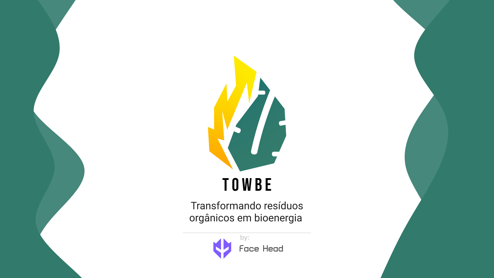
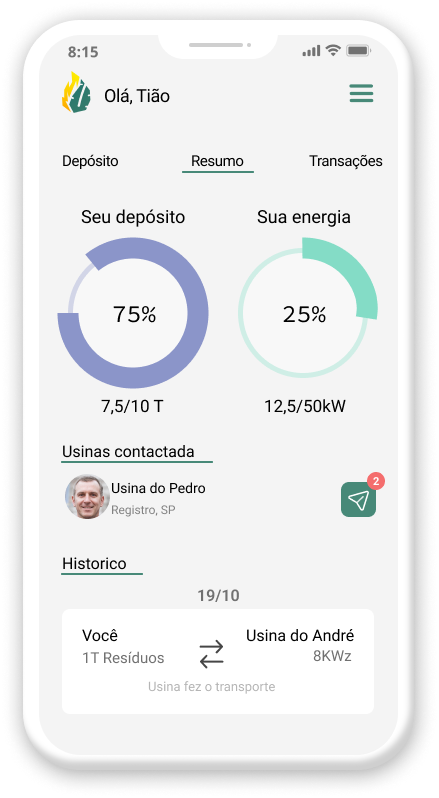

# TOWBE
 Projeto do primeiro semestre de Desenvolvimento de Software Multiplataforma - FATEC
 
## O que é o TOWBE?
A proposta deste projeto é o de desenvolver um sistema para conectar bananicultores e usinas em busca de biomassa da banana, a fim de fornecer os meios para uma gestão de seus estoques e facilitar a venda da biomassa ou a troca por uma parcela da energia gerada.

### O que eu fiz?
Fiquei resposável por criar a apresentação, o protótipo no figma e o website do projeto.
 
### Website
link: https://luizlopes12.github.io/site_ODS/

### Protótipo interativo
link: https://www.figma.com/proto/1rXc8AuJge08Xg8hMvEVBr/Projeto-Integrador---UI?node-id=0%3A1

### Contribuidores

- [x] <a href="https://github.com/luizlopes12" target="_blank">Luiz Lopes</a>
- [x] <a href="https://github.com/mfelipegs" target="_blank">Matheus Felipe</a>
- [x] <a href="https://github.com/MateusOK" target="_blank">Mateus Ribeiro</a>
- [x] <a href="https://github.com/cuckoo-head" target="_blank">Levi Azevedo</a>
- [x] <a href="https://github.com/LuizGustavoSouzaAlmeida" target="_blank">Luiz Gustavo</a>
